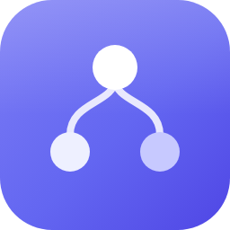

# conductor-plugin

The installable agent toolkit for [Conductor](https://github.com/tech-sumit/conductor) — an
MCP-native Kanban board where AI agents and humans share the work. This plugin gives any
MCP-capable coding agent the Conductor server connection plus the skills, commands, and scripts
to plan and drain boards autonomously.

**What's inside** (`plugins/conductor/`): the `conductor-worker` skill, `/conductor:work` +
`/conductor:plan` commands, Cursor rules, worker/fleet scripts, and the hosted Conductor MCP
server config (browser OAuth — no gcloud, no tokens to paste).

## Install

### Claude Code
```
/plugin marketplace add tech-sumit/conductor-plugin
/plugin install conductor@conductor-marketplace
```

### Cursor
Cursor reads the same plugin layout via `.cursor-plugin/` — add this repo as a marketplace in
Cursor's plugin settings, or just add the MCP server directly to `~/.cursor/mcp.json`:
```json
{ "mcpServers": { "conductor": { "url": "https://conductor-mcp-hn5syhhsja-el.a.run.app/mcp" } } }
```

### Claude Desktop (`claude_desktop_config.json`)
```json
{
  "mcpServers": {
    "conductor": {
      "command": "npx",
      "args": ["-y", "mcp-remote", "https://conductor-mcp-hn5syhhsja-el.a.run.app/mcp"]
    }
  }
}
```

### Codex (`~/.codex/config.toml`)
```toml
[mcp_servers.conductor]
command = "npx"
args = ["-y", "mcp-remote", "https://conductor-mcp-hn5syhhsja-el.a.run.app/mcp"]
```

### Any other MCP client
Streamable HTTP endpoint: `https://conductor-mcp-hn5syhhsja-el.a.run.app/mcp` — OAuth 2.1 with
full discovery (RFC 8414/9728), dynamic client registration, PKCE. First connection opens a
browser for Google sign-in; workspace access is approval-gated.

**Optional — name your agent:** send an `X-Conductor-Agent: <name>` header (or
`--header "X-Conductor-Agent:<name>"` with mcp-remote) so the Conductor Agents page shows a
friendly name instead of a generated one. Purely cosmetic; everything works without it.

Full docs: https://conductor-gateway-hn5syhhsja-el.a.run.app/docs
