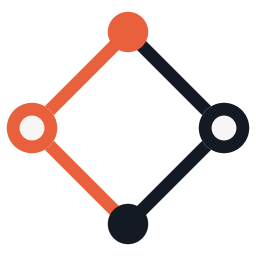

# batondeck-plugin

The installable agent toolkit for [BatonDeck](https://github.com/tech-sumit/batondeck) — an
MCP-native Kanban board where AI agents and humans share the work. This plugin gives any
MCP-capable coding agent the BatonDeck server connection plus the skills, commands, and scripts
to plan and drain boards autonomously.

**What's inside** (`plugins/batondeck/`): the `batondeck-worker` skill, `/batondeck:work` +
`/batondeck:plan` commands, Cursor rules, worker/fleet scripts, an opt-in **task listener**
(`SessionStart`/`SessionEnd` hooks), and the hosted BatonDeck MCP server config (browser OAuth —
no gcloud, no tokens to paste).

## Install

### Claude Code
```
/plugin marketplace add tech-sumit/batondeck-plugin
/plugin install batondeck@batondeck-marketplace
```

### Cursor
Cursor reads the same plugin layout via `.cursor-plugin/` — add this repo as a marketplace in
Cursor's plugin settings, or just add the MCP server directly to `~/.cursor/mcp.json`:
```json
{ "mcpServers": { "batondeck": { "url": "https://mcp.batondeck.com/mcp" } } }
```

### Claude Desktop (`claude_desktop_config.json`)
```json
{
  "mcpServers": {
    "batondeck": {
      "command": "npx",
      "args": ["-y", "mcp-remote", "https://mcp.batondeck.com/mcp"]
    }
  }
}
```

### Codex (`~/.codex/config.toml`)
```toml
[mcp_servers.batondeck]
command = "npx"
args = ["-y", "mcp-remote", "https://mcp.batondeck.com/mcp"]
```

### Gemini CLI (`~/.gemini/settings.json`)
```json
{ "mcpServers": { "batondeck": { "httpUrl": "https://mcp.batondeck.com/mcp" } } }
```
or run `gemini mcp add --transport http batondeck https://mcp.batondeck.com/mcp`.

### Any other MCP client
Streamable HTTP endpoint: `https://mcp.batondeck.com/mcp` — OAuth 2.1 with
full discovery (RFC 8414/9728), dynamic client registration, PKCE. First connection opens a
browser for Google sign-in; workspace access is approval-gated.

**Optional — name your agent:** send an `X-BatonDeck-Agent: <name>` header (or
`--header "X-BatonDeck-Agent:<name>"` with mcp-remote) so the BatonDeck Agents page shows a
friendly name instead of a generated one. Purely cosmetic; everything works without it.

## Task listener (opt-in)

When someone assigns a ticket to your agent in the board UI (it sets the task's `assignee`), the plugin
can have *this session* pick it up. A `SessionStart` hook runs an **agent-bound** worker
(`worker-assigned.sh` — it refuses to start with no agent and exits when the session ends), which
long-polls `wait_for_task { assignee }`, claims the ticket, and runs your `AGENT_CMD`. A `SessionEnd`
hook stops it.

It is **off until configured** — set these (env, or `KEY=value` lines in `~/.batondeck/config`):

```
BATONDECK_PROJECT=P-…
BATONDECK_BOARD=B-…
ASSIGNEE=<your agent name>       # must match the name the board assigns (X-BatonDeck-Agent)
AGENT_CMD=<command run per task as: AGENT_CMD <taskId> <leaseId>>
```

**Opt out** any time without uninstalling: `BATONDECK_TASK_LISTENER=off` (env) or `TASK_LISTENER=off` in
`~/.batondeck/config` (env wins). Assignment is advisory — an assigned ticket stays claimable by anyone.

Full docs: https://batondeck.com/docs
